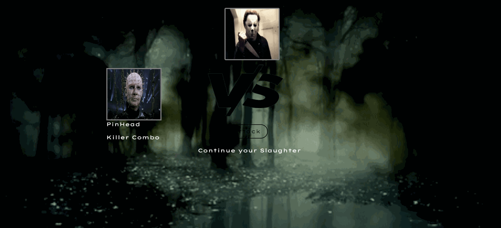

# Serial Slashers: The Game
### *RP as your favorite slashers stars in this fun application*

## Local Usage
* Clone this repo to your computer
* Open from index.html file
* Enjoy!
## Technologies: 
* [Javascript](https://www.javascript.com/) - The scripting language used to manipulate the DOM. 
* [HTML5](https://developer.mozilla.org/en-US/docs/Web/Guide/HTML/HTML5) - Mark up language used for structuring pages. 
* [BootStrap](https://getbootstrap.com/) - popular framework for building responsive websites
* [CSS](https://developer.mozilla.org/en-US/docs/Web/CSS) -is a stylesheet language used to describe the presentation of a document written in HTML or XML
* [Animate.css](https://github.com/daneden/animate.css) - animate.css is an animation library

## Links: 
* Repo: [GitHub Repo](https://github.com/lmd808/my_jquery_game/).
* Deployed: [GitHub Pages](https://lmd808.github.io/my_jquery_game/).

## Demo:  

## Challenges: 
* This whole project was a challenge, but I learned quite a bit and really pushed myself to make something interactive and fun. 

## Creator: 
Laura DiTommaso [GitHub](https://github.com/lmd808)
